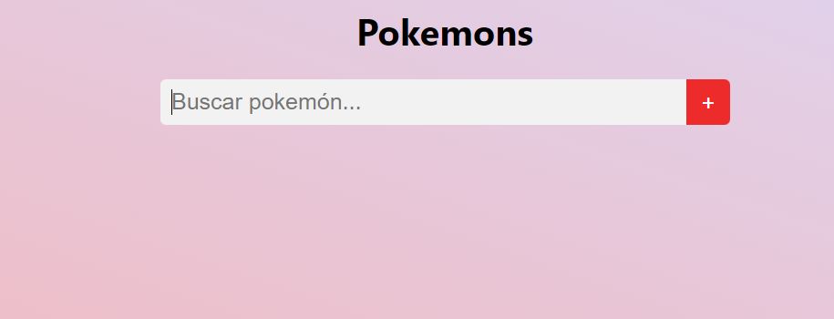

# Problema6-afrus
<h2>Crear una página en donde se muestre un campo de texto que permita buscar en el siguiente API: https://pokeapi.co/, por el número o nombre del pokémon y muestre en pantalla los siguientes datos: Nombre, número, tipo, peso, altura y una imágen.</h2>

Este problema fue realizado con React

Una vez clonado el repositorio, ingrese en su terminal al mismo, y ejecuté npm install

Luego de la instalación, escriba en su terminal npm start y vera que se abrirá una pestaña en su navegador con la solución

Si siguió los pasos correctamente, tendría que ver esto

Ingrese el pokemon que desee y listoo :) 
